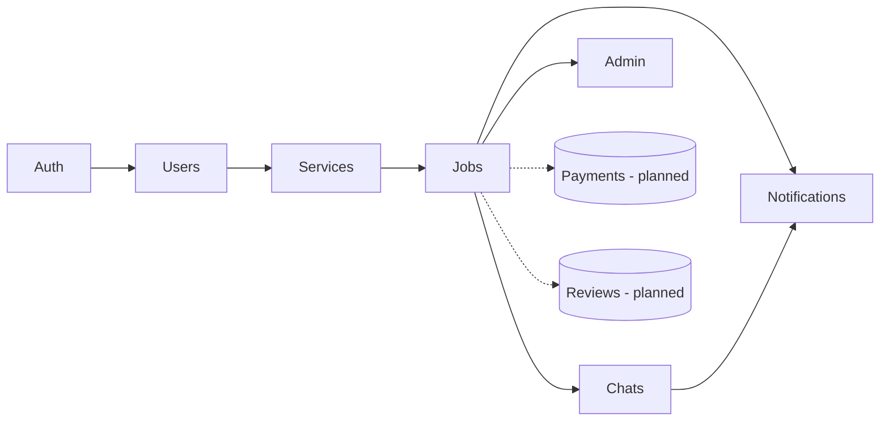
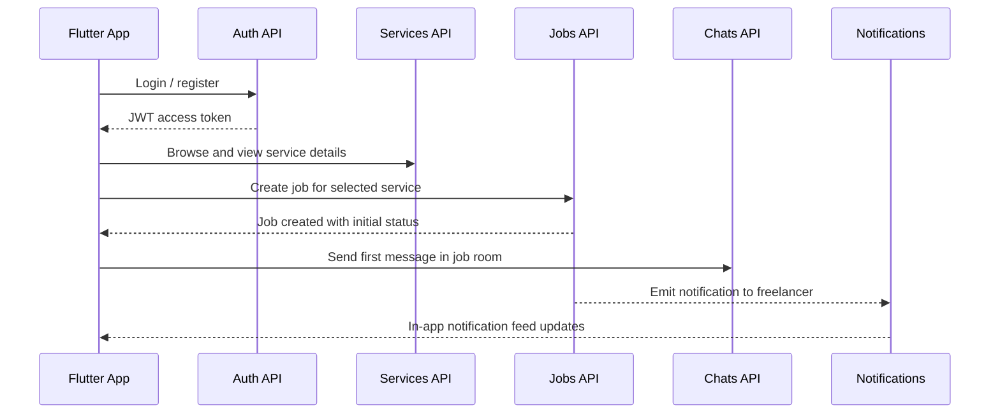

# Freetask API Architecture

## Overview
The Freetask API is built with **NestJS** and **Prisma** on PostgreSQL. It exposes REST endpoints that power the Flutter client, plus Socket.IO for live chats. Swagger UI is available at `/api/docs` when the server is running.

## Modules
- **AuthModule** – Handles registration, login, JWT strategy, and request guards.
- **UsersModule** – Manages user profiles, bios, skills, avatar updates, and hourly rates.
- **ServicesModule** – CRUD for freelancer service listings with category filtering.
- **JobsModule** – Manages job lifecycle (draft → accepted → in progress → completed / disputed) and role-based actions.
- **ChatsModule** – Job-centric messaging with persistence and WebSocket broadcasts.
- **NotificationsModule** – Stores in-app notifications and read-state tracking.
- **UploadsModule** – Authenticated file uploads (images/PDF) stored on disk and served statically.
- **AdminModule** – Admin-only health and future analytics endpoints.
- **PrismaModule** – Centralizes Prisma Client and database access.
- **Payments & Reviews (planned)** – Stubs referenced by the app; backend endpoints can be added alongside Prisma models when ready.

## Authentication & Authorization
- Credentials are exchanged for JWTs (`Authorization: Bearer <token>`). Token validation is enforced via `JwtAuthGuard` on protected routes.
- Auth endpoints issue tokens; profile endpoints rely on `GetUser` decorator to retrieve the authenticated user ID and role from the request context.

## Data Access with Prisma
- Prisma Client connects to PostgreSQL using `DATABASE_URL` from the environment.
- Migrations are stored under `prisma/migrations` and applied with `npm run prisma:migrate`.
- Seed data lives in `src/seed.ts` and can be executed with `npm run prisma:seed` after migrations.

## AppModule Wiring
`AppModule` imports feature modules and provides shared configuration (Prisma, Config, WebSockets). Each module encapsulates its controller(s), service, and data access.

## System Overview
```mermaid
flowchart LR
  A[Flutter Web / Mobile] -->|REST / WebSocket| B[Freetask API (NestJS)]
  B -->|ORM| C[(PostgreSQL)]
  B -->|Static| D[Uploads directory or S3-compatible storage]
  B -->|Webhook-ready| E[Payment Gateway (Stripe/ToyyibPay - planned)]
  B -->|Async| F[Notification channels (Email/FCM - planned)]
```

## Module Interaction


## User Flow Example: Hiring a Freelancer


## Swagger / OpenAPI
- Generated in `src/main.ts` using `@nestjs/swagger` and exposed at `/api/docs`.
- Controllers are grouped by tags (Auth, Users, Services, Jobs, Chats, Uploads, Notifications, Admin).
- DTOs annotate payload shapes for quick reference in the UI.
